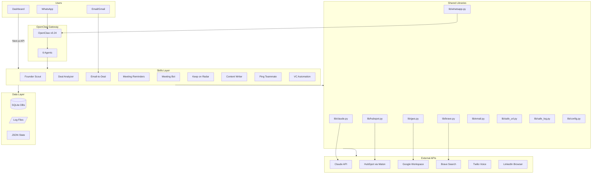
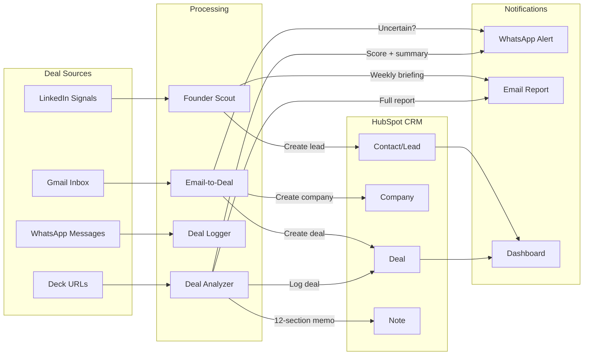
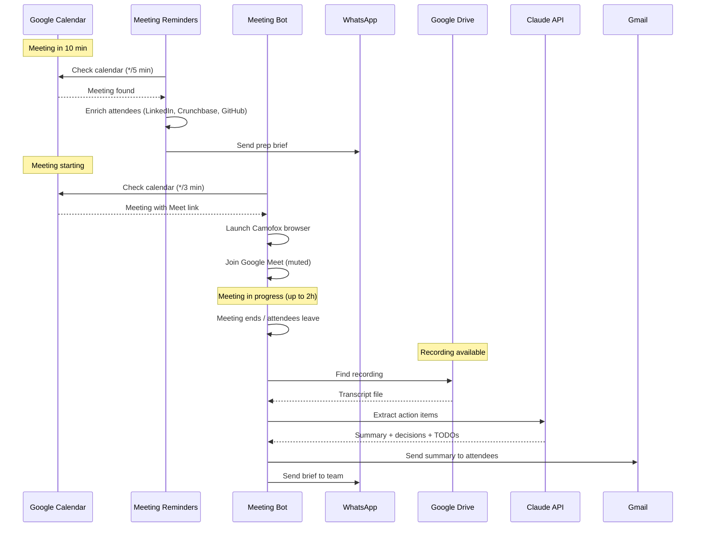
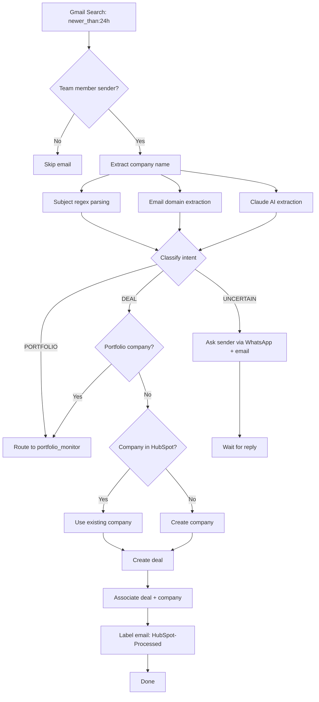
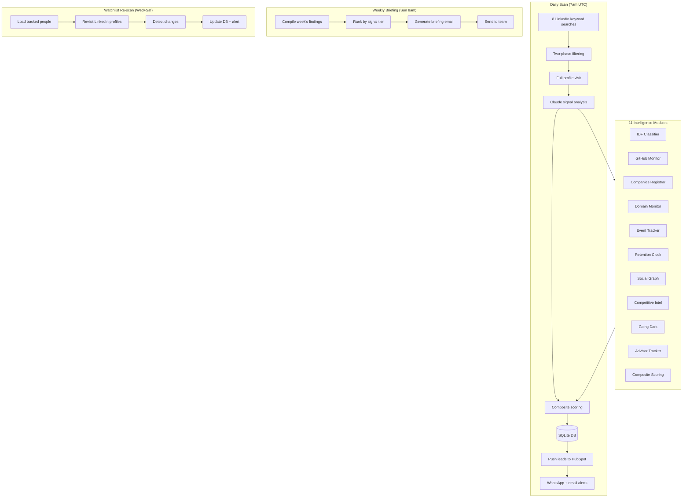
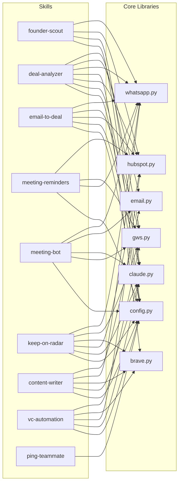

# GroundUp Toolkit — Architecture Diagrams

> Generated: 2026-03-14

## 1. High-Level System Architecture



## 2. Data Flow: Deal Sourcing Pipeline



## 3. Meeting Lifecycle



## 4. Email-to-Deal Pipeline



## 5. Founder Scout Workflow



## 6. Dashboard Architecture

```mermaid
graph TB
    subgraph Client["Browser (React 19)"]
        Pages[Pages: /, /portfolio, /settings, /login]
        Widgets[18 Dashboard Widgets]
        Chat[Chat Window]
        Store[Zustand Stores]
        RQ[TanStack React Query]
    end

    subgraph Middleware["Next.js Middleware"]
        Auth[NextAuth JWT]
        RL[Rate Limiter]
        Headers[Security Headers]
    end

    subgraph API["22 API Routes"]
        Pipeline[/api/pipeline]
        Stats[/api/stats]
        Signals[/api/signals]
        Leads[/api/leads]
        DealFlow[/api/deal-flow]
        Portfolio[/api/portfolio]
        Services[/api/services]
        ChatAPI[/api/chat]
        Actions[/api/actions]
        Other[... 13 more routes]
    end

    subgraph DataSources["Data Sources"]
        HS[HubSpot API]
        DB[(SQLite)]
        LogFiles[/var/log/*.log]
        OCAgent[OpenClaw Agent]
    end

    Pages --> RQ
    Chat --> Store
    RQ --> API
    Store --> API

    API --> Auth
    API --> RL

    Pipeline --> HS
    Stats --> HS
    Stats --> LogFiles
    Signals --> DB
    Signals --> LogFiles
    Leads --> DB
    DealFlow --> HS
    Portfolio --> HS
    ChatAPI --> OCAgent
    Actions -->|execSync| OCAgent
    Services -->|In-memory| Services
```

## 7. Cron Schedule Timeline (UTC)

```
Hour  | 0  1  2  3  4  5  6  7  8  9  10 11 12 13 14 15 16 17 18 19 20 21 22 23
------+------------------------------------------------------------------------
*/3m  | MB MB MB MB MB MB MB MB MB MB MB MB MB MB MB MB MB MB MB MB MB MB MB MB
*/5m  | MR MR MR MR MR MR MR MR MR MR MR MR MR MR MR MR MR MR MR MR MR MR MR MR
*/15m | HC HC HC HC HC HC HC HC HC HC HC HC HC HC HC HC HC HC HC HC HC HC HC HC
*/15m | PP PP PP PP PP PP PP PP PP PP PP PP PP PP PP PP PP PP PP PP PP PP PP PP
*/30m | LW LW LW LW LW LW LW LW LW LW LW LW LW LW LW LW LW LW LW LW LW LW LW LW
*/2h  | ET    ET    ET    ET    ET    ET    ET    ET    ET    ET    ET    ET
*/2h  | KR    KR    KR    KR    KR    KR    KR    KR    KR    KR    KR    KR
Daily |             PM DM       FS FB                                    LD
------+------------------------------------------------------------------------

MB = meeting-bot auto-join     MR = meeting-reminders    HC = health-check
PP = post-meeting-processor    LW = log-watcher          ET = email-to-deal
KR = keep-on-radar replies     PM = portfolio-monitor     DM = daily-maintenance
FS = founder-scout scan        FB = founder-scout brief   LD = log-watcher digest
```

## 8. Security & Auth Flow

```mermaid
flowchart TD
    subgraph Dashboard["Dashboard Auth"]
        Login[Google OAuth Login]
        Login --> Check{@groundup.vc?}
        Check -->|Yes| JWT[Issue JWT Cookie]
        Check -->|No| Deny[Access Denied]
        JWT --> MW[Middleware Check]
        MW --> API[API Route]
        API --> RateLimit{Rate Limit OK?}
        RateLimit -->|Yes| Process[Process Request]
        RateLimit -->|No| 429[429 Too Many Requests]
    end

    subgraph Skills["Skill Auth"]
        Config[config.yaml + .env]
        Config --> Maton[Maton Bearer Token]
        Config --> Claude[Anthropic API Key]
        Config --> GWS[gws-auth OAuth2]
        Config --> Brave[Brave API Key]
        Config --> Twilio[Twilio SID + Key]
    end

    subgraph Protection["Security Measures"]
        SSRF[SSRF: Domain allowlist + IP pinning]
        Shell[Shell: List-based subprocess]
        PII[PII: safe_log.py redaction]
        Headers[Headers: CSP, X-Frame, HSTS]
    end
```

## 9. Component Dependency Graph


